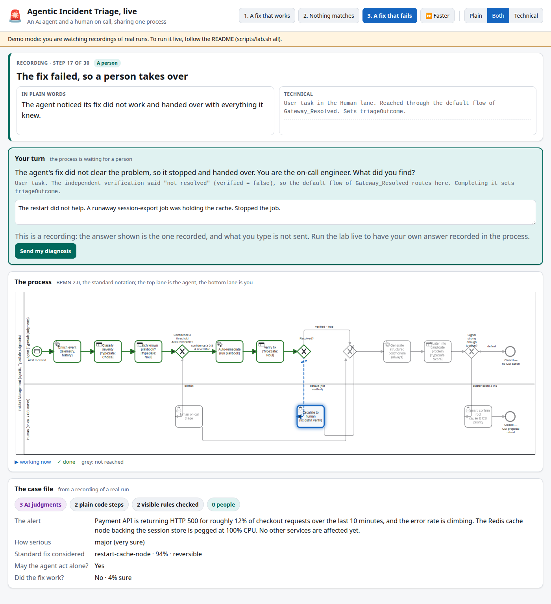
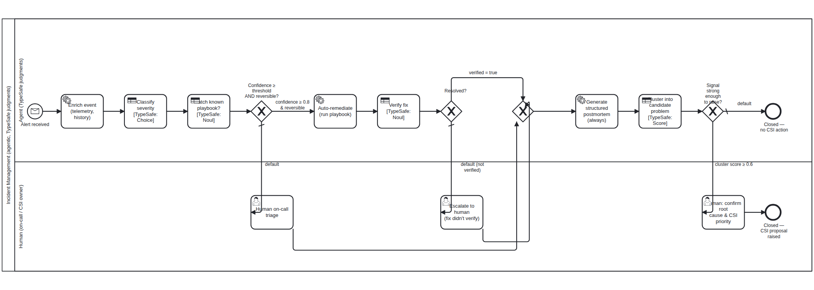
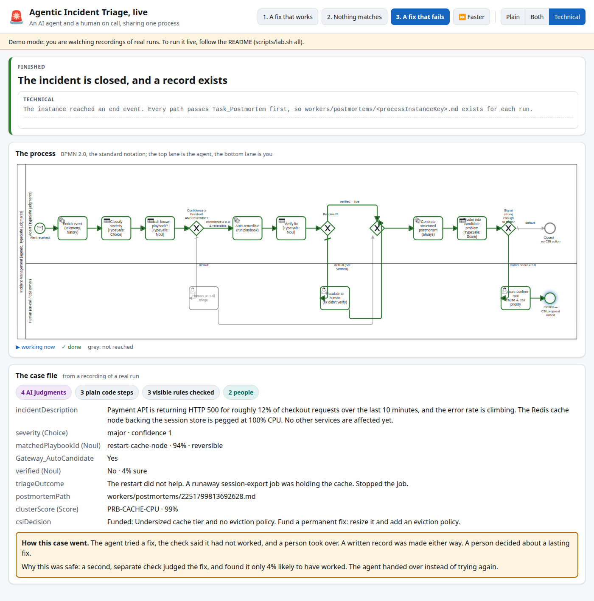

# Agentic Incident Triage

*A small, working lab: an AI agent and a human on call share one process, and the process decides who may do what.*

---

It is 3 a.m. A pager goes off. Checkout is failing for one customer in eight, and the cache server behind it is pinned at full load. The fix is known. Someone has done it a dozen times: restart the node, wait, check the graphs.

Now picture an AI agent doing that restart for you. Most of us feel two things at once. We want the sleep. We do not want a machine restarting production on a guess.

This project is a lab for that moment. It takes a real incident process and shows, step by step, where an AI judges, where plain code acts, and where a person must decide. Nothing is hidden inside a prompt. The rules sit in a diagram you can read, and the engine that runs the diagram enforces them.

> *An agent should be trusted exactly as far as its rules say, and the rules should be visible.*

That is the whole argument. The rest of this page shows it working, then shows you how to run it yourself.



*The live view. The same case is told twice: plain words on the left, technical detail on the right. The diagram lights up as the process moves.*

---

## Try it in thirty seconds

You do not need an account, a key or an engine for this. The demo replays three recordings of real runs.

```bash
git clone https://github.com/gerspcs/agentic-itil-workflow
cd agentic-itil-workflow
python3 -m http.server 8000 --bind 127.0.0.1
```

Open <http://127.0.0.1:8000/ui/>, pick a case, and watch. (`scripts/lab.sh demo` does the same.) When the process reaches a person, it stops and waits for you.

---

## The hospital front desk

Think of a hospital front desk. A patient walks in. A nurse takes a quick history. A triage nurse decides how serious it is. If a standard treatment fits, and it is safe to undo, the nurse tries it. Then someone checks the patient again. If the treatment did not work, or nothing fits, a doctor takes over. Whatever happens, a note goes in the chart.

That is this process, with a software incident in place of the patient. Here are the words you will meet:

| Hospital | In this lab | Plain meaning |
|---|---|---|
| A patient arrives | **Alert** | A monitoring system says something is wrong. |
| The nurse's quick history | **Enrich** | Plain code gathers context. |
| The triage level | **Classify severity** | The AI picks one level: cosmetic, minor, major or critical. |
| The standard treatment | **Playbook** | A written fix that people have already approved. |
| "Does this case fit?" | **Match pattern** | The AI answers one yes-or-no question about one playbook. |
| The check after treatment | **Verify fix** | A second, separate AI judgment looks at the numbers afterwards. |
| The chart note | **Postmortem** | A written record, always made. |
| "Is this the third case of the same infection?" | **Cluster problem** | The AI scores how closely this case matches known repeating problems. |
| The ward manager's decision | **CSI** | Continual service improvement: a person decides whether to fix the root cause. |

The words come from **ITIL**, a widely used set of practices for running IT services. An *incident* is something that has broken now. A *problem* is the cause behind incidents that keep coming back.

---

## The process at a glance



The diagram is **BPMN 2.0**, the standard notation for business processes. It is not a drawing of the process. It *is* the process: the file `bpmn/agentic-incident-triage.bpmn` runs on an open-source engine, Camunda 8.

Read it left to right in the top lane. The agent enriches, classifies, matches, acts, verifies, writes the record and clusters. The bottom lane holds the three places a person steps in.

### Two kinds of step

Not every step needs an AI. This is the line the design draws, and it draws it hard.

| Kind | Steps | Why |
|---|---|---|
| **AI judgment** (TypeSafe) | Classify severity, match pattern, verify fix, cluster problem | These need reading and weighing. Code cannot do them well. |
| **Plain code** | Enrich, auto-remediate, postmortem | These are fixed logic. Dressing them up as AI would only add risk. |
| **A person** | On-call triage, escalate, confirm root cause | These are decisions the agent is not allowed to make. |

The AI side uses **TypeSafe**, a service that returns typed answers instead of free text. Three kinds appear here. A *Choice* picks one option from a set. A *Noul* gives the probability that one yes-or-no statement is true. A *Score* places something on an ordered scale. Each comes back with a number the process can test.

### Three gates

Between the steps sit three gates. Each gate is a visible rule, written in the diagram.

| Gate | The rule | If the rule fails |
|---|---|---|
| **1. May the agent act alone?** | Sure of the match at 80% or more, **and** the fix can be undone | A person takes over. Nothing has been changed. |
| **2. Is it really fixed?** | The independent check says yes | A person is called with the full story. No silent retry. |
| **3. Worth a person's attention?** | The case matches a known repeating problem at 60% or more | The case closes, with a note saying so. |

Two things matter here. The first is the word **and** in gate 1. A sure agent still may not do something that cannot be undone. The second is that the AI never *is* the gate. The AI produces a number. The gate is a rule over that number, in plain sight, and you can change it and watch the behaviour change.

---

## Three cases, three endings

The lab ships with three alerts. Each one exercises a different path through the gates.

| Case | What happens | What to watch for |
|---|---|---|
| **1. A fix that works** | A cache server is overloaded. The agent finds the standard fix, applies it and checks. A person then decides whether the problem deserves a lasting fix. | The agent acts alone, and a second check agrees. |
| **2. Nothing matches** | Photo uploads are slow in one region, with no errors logged. No playbook fits. | The agent does nothing, and says why. A person diagnoses it. |
| **3. A fix that fails** | The same cache problem, but the fix does not work. | The agent notices, hands over, and does not try again. |

All three were recorded from real runs: a live Camunda 8 engine, with live TypeSafe judgments. In live mode you can also type your own incident and see where the agent sends it.



*The case file fills in as the process moves. The summary at the bottom says why the agent was, or was not, allowed to act.*

---

## Watch it run

The viewer shows the process two ways at once.

- **Plain** is for anyone. It uses the hospital picture and avoids jargon.
- **Technical** shows the job type, the variables, the exact gate condition and the TypeSafe call behind each step.
- **Both** shows them side by side. It is the default.

Click any step in the diagram to pin it and read about it. The **Faster** button speeds up the walk through the steps. The counters at the bottom show how many steps used AI, how many used plain code, and how many needed a person.

---

## Run it live

Live mode runs a real Camunda 8 engine on your machine and sends real questions to TypeSafe. It needs a key. Everything else the lab can set up for you.

### What your machine needs

Run the check first. It changes nothing.

```bash
scripts/lab.sh check
```

| Need | Minimum | Why |
|---|---|---|
| CPU | 2 cores | The engine and the worker run side by side. |
| Memory | 3 GB **available** | The engine idled near 0.8 GB when measured. This leaves headroom. |
| Disk | 4 GB free | The engine download is about 1.1 GB. |
| Node.js | 20 or newer | It runs `c8ctl`, the Camunda command-line tool. |
| Java | 21 or newer | The engine runs on it. |
| Python | 3.9 or newer | The worker and the viewer use only the standard library. There is nothing to `pip install`. |
| Ports | 8080, 26500, 9600, 8099 | If 8080 is taken, set `C8_PORT` in `.env`. |
| Internet | to `api.typesafe.ai` and for the one-off engine download | |

The check prints PASS, WARN or FAIL for each line and says how to fix a failure. It never uses `sudo`. If a step needs root, such as installing Java, it prints the exact command for you to run.

### Give the lab your TypeSafe key

The worker needs a TypeSafe API key. The key is yours. The repository never contains one, and the lab never prints it.

1. Get a key from your TypeSafe account. The TypeSafe documentation (<https://docs.typesafe.ai>) shows where.
2. Copy the example file and lock it down:

   ```bash
   cp .env.example .env
   chmod 600 .env
   ```

3. Open `.env` and put the key after the equals sign, with no quotes and no spaces:

   ```
   TYPESAFE_API_KEY=your-key-here
   ```

4. Check that the lab can see it. The check prints that the key is set, never its value:

   ```bash
   scripts/lab.sh check
   ```

You can instead export `TYPESAFE_API_KEY` in your shell. The shell wins over `.env`. The worker reads nothing from outside this folder.

Four things to know:

- `.env` is listed in `.gitignore`. Check `git status` before any commit, and never paste the key into an issue, a chat or a log.
- Only the incident text and the questions about it go to `api.typesafe.ai`. The engine runs locally.
- One incident makes five or six TypeSafe calls: one each for severity, match and verify, and one per known problem cluster (three ship with the lab). Verify is skipped when no fix was tried.
- If a key leaks, revoke it in your TypeSafe account and make a new one.

### Set up and start

```bash
scripts/lab.sh setup     # installs c8ctl and the engine, creates .env, adds a c8ctl profile
scripts/lab.sh all       # engine, deploy the model, start the worker, open the viewer
```

`setup` installs only into your home directory. It never uses `sudo` and does not change your active `c8ctl` profile. The first engine start takes roughly half a minute. Then open <http://127.0.0.1:8099>.

Or run the stages one at a time:

```bash
scripts/lab.sh engine    # start Camunda 8 and wait until it answers
scripts/lab.sh deploy    # deploy bpmn/agentic-incident-triage.bpmn
scripts/lab.sh worker    # start the job worker in the background
scripts/lab.sh ui        # the live viewer, in the foreground
scripts/lab.sh status    # what is running right now
```

You can also drive the process without the viewer:

```bash
c8ctl publish msg "Alert (monitoring/event system)" --correlationKey demo-1 \
  --variables '{"incidentDescription":"Payment API is returning HTTP 500 for 12% of checkouts. The Redis cache node is pegged at 100% CPU."}'
```

Human steps appear in Camunda's own Tasklist too.

### Tear it down

```bash
scripts/lab.sh teardown                # a dry run: lists what it would do, changes nothing
scripts/lab.sh teardown --apply        # stops the worker, viewer and engine this lab started
```

The default teardown removes only what the lab generated. Deeper cleaning is opt-in, one flag at a time: `--purge-data` wipes the engine's runtime data, `--remove-profile` removes the `c8ctl` profile the lab added, `--remove-env` deletes your `.env` (and so your saved key), and `--remove-engine` deletes the 1.1 GB download. It never touches Node, Java, Python, `c8ctl` itself, or your TypeSafe account. It stops the engine only if this lab started it.

---

## Agent setup

You can hand this lab to an AI coding assistant, such as Claude Code, and ask it to set it up. The runbook for the assistant is [`AGENTS.md`](AGENTS.md). It tells the assistant what to run, in what order, what counts as done, and what it must never do.

Paste this to your assistant:

```text
Read AGENTS.md in this repository, then set up and run the Agentic Incident Triage
lab on my machine. Run scripts/lab.sh check first and show me the result before
installing anything. Do not use sudo: if something needs root, print the command
and ask me to run it. I will add my own TypeSafe key to .env. Never print it.
When you finish, show me the evidence listed under "Definition of done".
```

The rules the assistant works under:

- **Check before changing anything.** It reports the machine check to you first.
- **No `sudo`.** Root steps come back to you as a command to copy.
- **No secrets in output or in git.** It never prints `.env`, and never commits it.
- **No weakening to make something pass.** It does not lower a threshold, skip a check or edit a gate to get a green result.
- **Evidence, not exit codes.** It must show you the output that proves each step.
- **Confirm before deleting.** Teardown starts as a dry run, and it shows you the list first.

---

## Make it yours

Everything that matters is a small file you can edit.

| To change | Edit | Then |
|---|---|---|
| A gate threshold (0.8, 0.6) | `bpmn/agentic-incident-triage.bpmn`, the `conditionExpression` of the flow | `scripts/lab.sh deploy` |
| The standard fixes | `workers/fixtures/playbooks.json` | restart the worker |
| The known repeating problems | `workers/fixtures/problem_clusters.json` | restart the worker |
| What the AI is asked | the `h_*` handlers in `workers/agentic_worker.py` | restart the worker |
| The three cases and the words on the page | `ui/story.json` | reload the page |

Try this: lower gate 1 to `matchConfidence >= 0.5`, redeploy, and send case 2 again. Watch what changes. It is the quickest way to feel what a confidence threshold does.

The fixtures stand in for the systems a real deployment would call: telemetry, a playbook catalogue, a problem tracker. The lab is about the wiring between judgment and gate, not about those integrations.

### Tests

```bash
python3 -m unittest discover -s tests -v
```

The tests need no engine and no key. They check candidate selection, the fix-outcome switch, how settings are read, that the page's story covers every element of the model, and that no private path or key sits in the tree.

---

## What is real, and what is simulated

I want you to know exactly what you are looking at.

| Real | Simulated |
|---|---|
| A Camunda 8 engine runs the BPMN model, and enforces the gates. | The telemetry. The incident text is typed, not detected. |
| Four steps make live TypeSafe calls, and their numbers drive the gates. | The fix. "Auto-remediate" does not restart anything. It returns a synthetic reading. |
| People complete real user tasks, in the viewer or in Camunda's Tasklist. | The playbook catalogue and the problem tracker are two small JSON files. |
| The demo recordings are final snapshots of real runs. | The pick of a candidate playbook uses word overlap, not embeddings. |

The fix is simulated so you can run the lab safely on a laptop. In case 3 the outcome is pinned to "fails" with the `fixOutcome` variable. Otherwise a fix works about four times in five, and the independent check has to tell the difference.

### What has and has not been tested

- The live path was run end to end on one machine: Linux, 8 cores, about 23 GiB of memory, Camunda 8.10.0-alpha5. All three cases, and a typed incident, completed in the viewer.
- Python was tested on 3.12 only. The 3.9 minimum comes from the language features used, not from a run.
- It has not been tested on macOS or Windows. `scripts/lab.sh check` has a macOS branch that is untested.
- It has not been tested on a machine at the minimum sizes above, or with an empty engine cache beyond the first download.
- The engine version is an alpha release, pinned because it is the one tested. Set `C8_VERSION` in `.env` to try another. Expect to adjust.
- It is a teaching lab, not a production incident system. There is no authentication on the viewer beyond a per-session token on loopback, and it is not meant to be exposed.

---

## What is in this repository

```
bpmn/        the executable process model (opens in Camunda Modeler or bpmn.io)
workers/     the job worker: seven job types, four with TypeSafe calls
  fixtures/  the playbooks and known problem clusters
ui/          the live viewer: server, page, story text, recorded runs
scripts/     lab.sh: check, setup, run, tear down
tests/       offline tests
docs/        the diagram images, screenshots, and design.md
AGENTS.md    the runbook for AI coding assistants
.env.example the settings, with the key left blank
```

For the thinking behind the design, read [`docs/design.md`](docs/design.md). It covers why a model and not a picture, the matrix that maps ITIL activities to judgment types, the rules for when a human must decide, and the bugs the live runs caught that no static check could.

### Where to go next

- TypeSafe documentation: <https://docs.typesafe.ai>
- Camunda 8 documentation: <https://docs.camunda.io>
- The BPMN 2.0 specification, as published by the Object Management Group (formal/2011-01-03)

---

## Licence

Apache 2.0. See [`LICENSE`](LICENSE).
